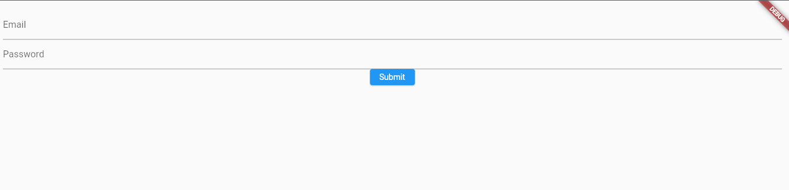
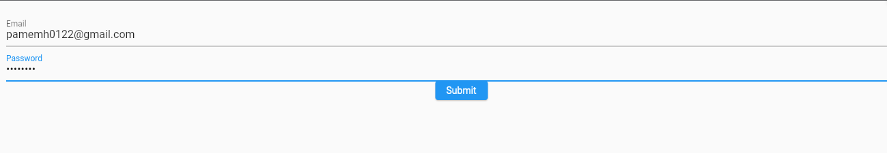
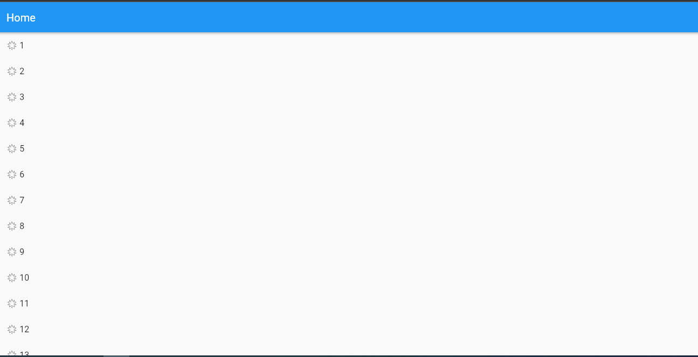
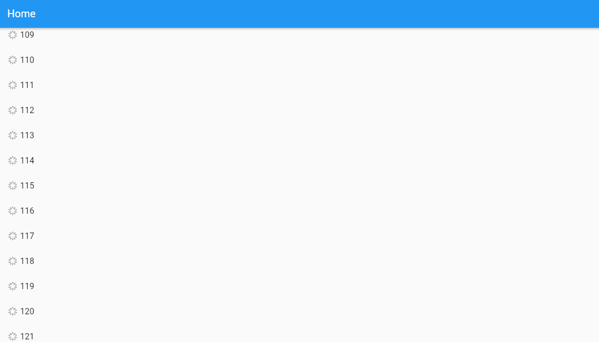

# Login_Flutter

El presente proyecto presenta un login y un infinite scrolling realizados en Flutter y con servicio de autentificación de Firebase.

# Autores

## * Lesly Herrera
## * Mayra Ñaupari
## * Jhon Torres

## Pantalla de inicio de sesión

## Pantalla que muestra las credenciales que se crearon en Firebase en el apartado de Autentificación

## Pantalla que muestra las credenciales dentro de la app

## Pantalla del scroll inicial

## Pantalla del scroll mientras se va bajando

